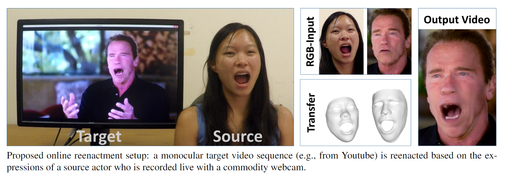
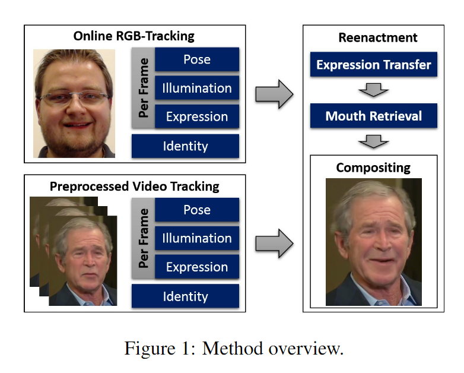
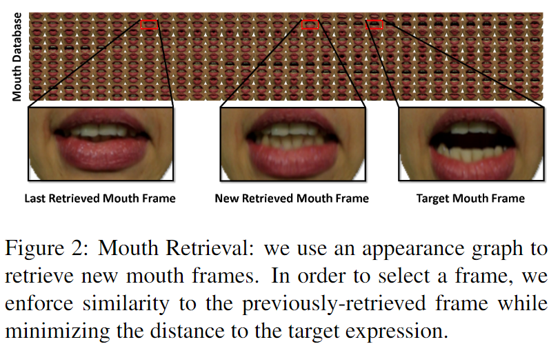

# Face2Face: Real-time Face Capture and Reenactment of RGB Videos

## I. Introduction

- Contribution:  a novel approach for **real-time facial reenactment** of a monocular target video sequence (animate the facial expressions of the target video by a source actor and re-render the manipulated output video)
  1. Reconstruct the shape identity of the target actor by **dense, global non-rigid model-based bundling**
  2. **Track** facial expressions of both source and target video using a **dense photometric consistency measure**
  3. Apply **deformation transfer** directly in the used **low-dimensional  expression space**
  4. Generates a **realistic mouth interior** by retrieving and warping best matching mouth shapes from the off-line sample sequence while **maintaining the appearance of the target mouth shape**
  5. **Re-render** the synthesized target face on top of the corresponding video stream

- Novelty:
  - the first real-time RGB-only reenactment technique
  - synthesize the mouth regions exclusively from the target sequence (no need for a teeth proxy or direct source-to-target copy)

## II. Related Tech

- Morphable 3D Face Model([A Morphable Model for the Synthesis of 3D Faces](http://www.researchgate.net/publication/2892137_A_Morphable_Model_for_the_Synthesis_of_3D_Faces?ev=auth_pub))

  

  - Transforming the shape and texture into a vector space representation. 
  - Given some exemplar prototypes, new faces and expressions can be modeled by forming linear combinations of the prototypes. 
  - So the morphable model can be parameterized by the coefficients

## III. Method

### (0). Parametrized model

Multi-linear PCA model 

- 3 dimension: identity shape, reflectance albedo, expression):

$$
M_{geo}(\alpha, \delta)=a_{id}+E_{id}*\alpha+E_{exp}*\delta,\\
M_{alb}(\beta)=a_{alb}+E_{alb}*\beta
$$

- Data:
  - $a_{id},a_{alb}$: average shape and reflectance
  - $E_{id},E_{alb}\in R^{3n*80}$, $E_{exp}\in R^{3n*76}$: shape, reflectance, expression basis
- Parameters $P$:
  - Global
    - Identity: shape $\alpha$ and reflectance $\beta$
    - Camera: $\kappa$
  - Per-frame
    - Pose:  rigid rotation $R^k$ and rigid transformation $t^k$
    - Expression: expression $\delta^k$
    - Illumination: $\gamma^k$

### (1). Online RGB-tracking

#### 1. Energy Formulation

$$
E(P)=w_{col}E_{col}(P)+w_{lan}E_{lan}(P)+w_{reg}E_{reg}(P)
$$

##### Photo-Consistency

Measure the distance in **color space** on pixel level
$$
E_{col}(P)=\frac{1}{|V|}\sum_{p\in V}||C_S(p)-C_I(p)||_2
$$

- $C_s$: synthesized image by perspective transformation, related with model illumination and camera
- $C_I$: inputed RGB image
- $p\in V$: visible pixels in $C_S$

##### Feature Alignment

Enforce feature(facial landmark) similarity between a set of salient facial feature point pairs detected in the RGB stream
$$
E_{lan}(P)=\frac{1}{|F|}\sum_{f_j\in F}w_{conf,j}||f_j-\Pi(\Phi(v_j))||_2
$$

- $f_i, w_{conf,j}$: detected feature point and its confidence
- $\Phi$: rigid model transformation
- $\Pi$: perspective transformation

##### Statistical Regularization

Regularize the synthesized faces based on the prior
$$
E_{reg}(P)=\sum_{i=1}^{80}[(\frac{\alpha_i}{\sigma_{id,i}})^2+(\frac{\beta_i}{\sigma_{alb,i}})^2]+\sum_{i=1}^{76}(\frac{\delta_i}{\sigma_{exp,i}})^2
$$

- $\sigma_{id},\sigma_{alb}\in R^{80}$, $\sigma_{exp}\in R^{76}$: prior standard deviations of shape, reflectance and expression

#### 2. Optimization Strategy

Data-parallel GPU-based **Iteratively Reweighted Least Squares (IRLS)** solver.
$$
||r(P)||_2=\frac{||r(P)||_2^2}{||r(P_{old})||_2}
$$

- $r(.)$: general residual
- $P_{old}$: the solution computed in the last iteration. $r(P_{old})$ is kept constant during one iteration and updated afterward

### (2). Non-Rigid Model-Based Bundling

- **Jointly estimate** all parameters over $k$ key-frames of the input video sequence based
- Since all key frames observe the same face identity under potentially varying illumination, expression, and viewing angle, we can robustly **separate identity** from all other problem dimensions.

### (3). Expression Transfer

Transfer the expression changes from the source to the target actor while preserving person-specificness in each actor’s expression 

Operate directly in the space spanned by the expression blend shapes **(in expression sub-space**)
$$
E(\delta^T)=||A\delta^T-b||_2^2
$$

- The equation is the canonical least-squares form of equation(7)
- $\delta^T$: Target expression
- $A\in R^{6|F|*76}$:
  -  $|F|$ is the number of triangular faces
  -  $A$ is a constant and contains **the edge information of the template mesh** projected to the expression sub-space
- $b\in R^{6|F|}$:  $b$ contains **edge information of the target in neutral expression**, varies with $\delta^S$ and is computed for each new input frame

### (4). Mouth Retrieval

Assume that sufficient mouth variation is available in the target video,  we retrieve and warp the **best matching mouth image(source)** from the target actor sequence.

Maintain the appearance of the target mouth

#### 1. Similarity Metric D

We apply this **frame-to-frame distance** measure in a **frame-to-cluster matching strategy**
$$
D(K^T,K^S_t,t)=D_p(K^T,K^S_t)+D_M(K^T,K^S_t)+D_a(K^T,K^S_t,t)
$$

- Descriptor $K={R,\delta,F,L}$:
  - $R, \delta$: rotation and expression
  - $F$: facial landmarks
  - $L$: Local Binary Pattern(LBP)
- $K_S$: compute source descriptor for every frame in the training sequence
- $K_T$: consists of the result of the expression transfer and the LBP of the frame of the driving actor.

##### Distance in parameter space

$$
D_p(K^T,K^S_t)=||\delta^T-\delta^S||_2^2+||R^T-R^S||_F^2
$$

##### Differential compatibility of the sparse facial landmarks

$$
D_m(K^T,K^S_t)=\sum_{(i,j)\in\Omega}(||F_i^T-F_j^T||_2^2+||F_{t,i}^S-F_{t,i}^S||_2)^2
$$

- $\Omega$: a set of predefined landmark pairs (defining distances such as between the upper and lower lip or between the left and right corner of the mouth.)

#####  Appearance measurement

$$
D_a(K^T,K^S_t,t)=D_l(K^T,K^S_t)+w_c(K^T,K^S_t)D_c(\tau,t)
$$

- $D_l$:  measures the **similarity based on LBPs** that are compared via a *Chi Squared Distance*
- $D_c$: measures the similarity between **the last retrieved frame $\tau$** and the video frame $t$ based on **RGB cross-correlation** of the normalized mouth frames.
  - $w_c=e^{-D_m^2}$

#### 2.  Frame-to-Cluster Matching

1. Cluster the target sequence into $k=10$ clusters using a modified k-means algorithm **based on the pairwise similarity metric** $D$. 

2. For every cluster, select the frame with the minimal distance to all other frames within that cluster as **a representative**
3. Firstly measure the distances between the target descriptor $K_T$ and the descriptors of cluster representatives
4. Choose the cluster whose representative frame has the minimal distance as **the new target frame**.

#### 3. Appearance Graph

Building a fully-connected appearance graph of all video frames.

- The edge weights are based on the RGB cross-correlation between the normalized mouth frames, $D_p$, and $D_m$.

### (5) Re-render

1. Find an in-between frame that is **both similar to the last retrieved frame and the retrieved target frame** using appearance graph
2. Apply an **illumination correction** that considers the estimated Spherical Harmonic illumination parameters of the retrieved frames and the current video frame
3. **Blend** between the previously-retrieved frame and the newly-retrieved  frame in texture space on a pixel level, after optic flow alignment.
4. **Composite** the new output frame by alpha blending between the **original video frame**, the illumination-corrected, projected **mouth frame,** and the **rendered face model**

  