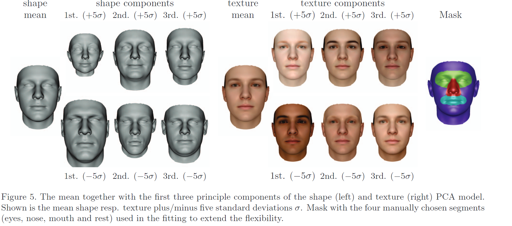
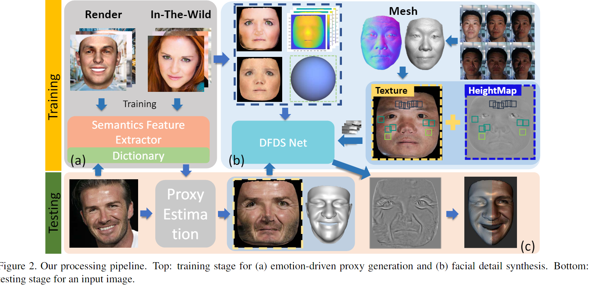
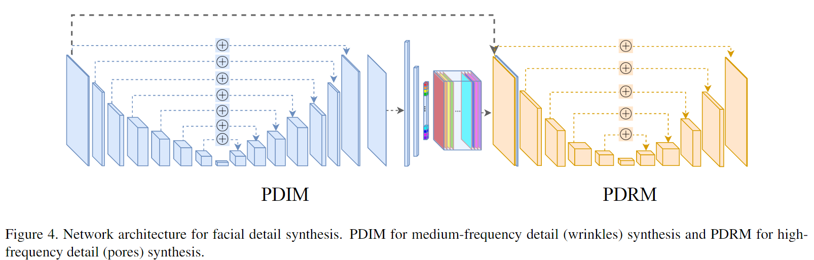

# Photo-Realistic Facial Details Synthesis From Single Image

[github](https://github.com/apchenstu/Facial_Details_Synthesis)

## I. Introduction

Contribution: produce high-quality **3D faces** with fine geometric details **from a single image**

- On Proxy generation 
  - face geometry 
  - expression analysis 
- On Detail synthesis:  **Deep Facial Detail Net (DFDN)**
  - Geometry: 3D scans - supervised
  - Appearance: in-the-wild face images - unsupervised

## II. Related Tech

- Basel Face Model[(BFS)](https://www.mendeley.com/catalogue/3d-face-model-pose-illumination-invariant-face-recognition/)
  - Compared with 3DMM, BFS has higher shape and texture accuracy due to a better scanning device and less correspondence artifacts due to an improved registration algorithm
  - parameterized with 1).shape, 2).expression and 3).albedo(texture)

- Displacement Map([移位贴图](https://blog.csdn.net/chenjinxian_3D/article/details/51885061))

  - 一个displacement map就是一个高度纹理图，只有一个通道值，并且存储了高度的大小

  - 使用displacement mapping时，**vertex沿着它的法线向量平移，该法线的值由一个displacement map指定**。

  - $$
    V\prime=V+\vec{N}*D
    $$

    

## III. Method

### (1). Expression-Aware Proxy Generation

Basel Face Model $M(\alpha, \beta, \gamma)$:
$$
M_{sha}(\alpha)=a_{sha}+E_{sha}*\alpha\\
M_{exp}(\beta)=a_{exp}+E_{exp}*\beta\\
M_{alb}(\gamma)=a_{alb}+E_{alb}*\gamma
$$

- $a_*$: mean of corresponding PCA space
- $E_*$: basis vectors

#### 1. Proxy Estimation

 Minimize the re-projection error on 2D facial landmarks
$$
E(\alpha, \beta)=\sum_kw_k||L_k-P(l_k(\alpha, \beta))||_2+\lambda_s||\alpha||_2
$$

- $L_k$is landmarks in RGB, $l_k$ is corresponding facial vertex
- $P(.)$ : camera projector, parameterized as an affine matrix 

**Solving**: Iterative linear method

1. fix $\beta$  as $\beta_{prior}$
2. fix $\alpha$ first to solve $P$ using the *Gold Standard Algorithm*
3. fix $P$ to solve $\alpha$ 

#### 2. Imposing Expression as Prior

Use facial semantic information to narrow the proxy parameter solving space via converting the problem into a conditional distribution

1. Use *AffectNet* dataset to train an **emotion feature predictor** *EmotionNet.*
   - sequential  fully-CNN architecture
   - use the output of the second last layer as the **feature vector** to represent human emotions 
2. **Randomly generate expression parameters $\beta$** and render 90K images with different facial expressions.  Feed the generated imaged to trained *EmotionNet* and get **90K emotion feature vector**
3. Use [appearance feature predictor](https://ieeexplore.ieee.org/document/7284869?arnumber=7284869&tag=1) to estimate **90K appearance feature vectors** on the images too.
4. **Concatenating** these emotion feature vectors along with corresponding appearance feature vectors,  we obtain **90K semantic feature vector** for each of the 90K images. 
5. Formulate **a dictionary** $\Psi=\{\Psi_{sem} \to \beta\}$
6. For a new Image $I$,  feed  it to Emotion-Net and appearance feature predictor to get its semantic feature vector,  find its closest semantic feature vector in the dictionary $\Psi$ and use the corresponding expression parameters $\beta$ as $\beta_{prior}$ 

### (2). Deep Facial Detail Synthesis

Synthesize geometric details by estimating displacement map using *Deep Facial Detail Net(DFDN)* and applying to the proxy mesh.

#### 1. Deep Facial Detail Net (DFDN)

##### Partial Detail Inference Module (PDIM)

- Input: 2D image patches + noise
- Output: medium-frequency(PCA-based technique) displacement map
  - recover **regular features** like wrinkles
- Architecture: UNet-8 + 4 * (FC+ReLU)

##### Partial Detail Refinement Module (PDRM) 

- Input: 2D image patches + naive displacement map
- Output: refined displacement map
  - recover **characteristic features** like pores and spots
- Architecture: UNet-6

##### Training

Combine supervised and unsupervised training techniques **based on Condi-tional Generative Adversarial Nets (CGAN)**
$$
L(G,D)=\min_G\max(D)(L_{cGAN}(G,D)+\lambda L_{L1}(G))\\
L_{cGAN}(G,D)=E_{x,y}[logD(x,y)]+E_{x,z}[log(1-D(x,G(x,z)))]\\
L_{L1}(G)=L_{scans}(x,z,y)+\eta L_{recon}(x)
$$

- observed image $x$, random noise $z$, ground-truth displacement map $y$
- $L_{cGAN}$: normal cGAN loss(conditioned on $x$)
- $L_{L1}$: semi-supervised loss
  - $L_{scans}$: supervised geometry loss based on scans capture
  - $L_{recon}$: unsupervised appearance loss based on in-the-wild images 

 #### 2. Geometry Loss

Compares the estimated displacement map with ground truth
$$
L_{scans}(x,z,y)=\sum||PCA(PDIM(x,z))-y||_1+||PDRM(PCA(PDIM(x,z)))-y||_1
$$

- $x,y$:
  - not to directly feed complete face images due to lack of sufficient 3D face models with fine details(only 706 scans)
  - Instead, use texture/displacement **patches** of 256×256 resolution
- $PCA(.)$: 
  - uses input PCA coefficients to linearly combine basis patches
  - each patch is a linear combination of 64 basis patches

#### 3. Appearance Loss 

the small amount of labeled facial geometry is insufficient to cover a broad range of illumination conditions and surface reflectance

1. Bbtain 163K in-the-wild images,

2. Estimate its **proxy model**, get the proxy model's **normal map** $N_{proxy}$ and **position map $P_{proxy}$**

3. Estimate its **displacement map** $G$ using *DFDN*, calculate **refined position map** $P_{fine}$ and **refined normal map** $N_{fine}$:
   $$
   P_{fine}=P_{proxy}+G*N_{proxy}\\
   N_{fine}=F(P_{fine})
   $$

   - $F(.)$:  normalized cross product operator on position difference,    computed via nearby horizontal and vertical 3 pixels in texture  space

4. Re-render an image with all these estimations:
   $$
   I_{recon}=I_{albedo}\odot S(N_{fine})
   $$

   - **albedo map** $I_{albedo}$ and **environment lighting** $S$ are estimated from proxy model

5. Compute reconstruction loss against the input image:
   $$
   L_{recon}=||I_{input}-I_{recon}||_1
   $$
   

