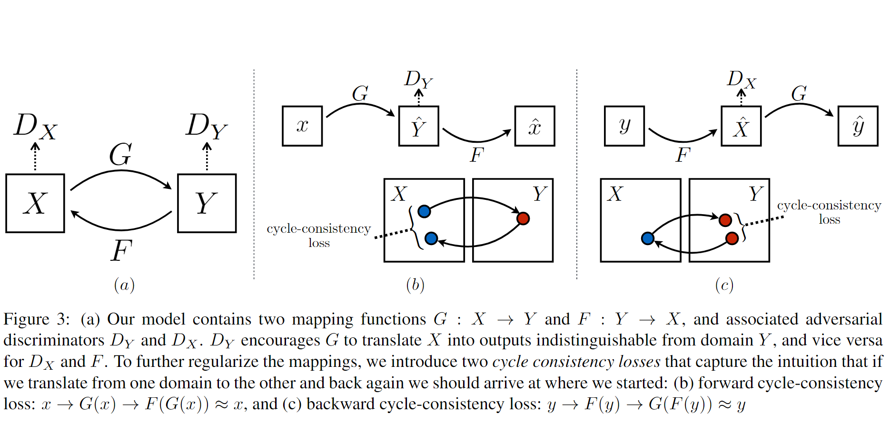
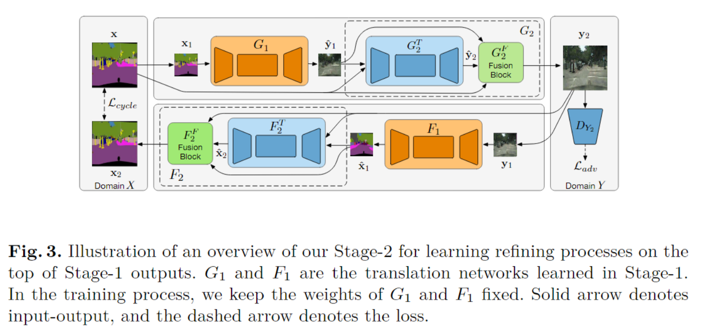

# Note

- Classical GAN:

$$
\begin{equation*}
\begin{split}
L_{GAN}(G,D)= &E_y[logD(y)]+\\
&E_{x,z}[log(1-D(G(x,z)))]
\end{split}
\end{equation*}
$$

## 1. pix2pix

Image-to-Image Translation with Conditional Adversarial Networks

- Contribution: 
  - **Conditional GAN**
  - learn a loss function for all applications

- Loss Function:  $L_{cGan}+\lambda L1$
  $$
  \begin{equation}
  \begin{split}
  L_{cGAN}(G,D)= &E_y[logD(x,y)]+\\
  &E_{x,z}[log(1-D(x,G(x,z)))]
  \end{split}
  \end{equation}
  $$

$$
L_{L1}(G)=E_{x,y,z}[||y-G(x,z)||_1]
$$

- Network Architectures

  

  - Generator:
    - **U-Net with skips**: shuttle some low-level information across the net
  - Discriminator: 
    - Use GAN discriminator to model high-frequency structure, use LI term to force low-frequency structure (only GAN->no similarity, only L1->blurring)
    - **PatchGAN**: restrict attention to the local image patches, and only penalize structure at the scale of patches
    - Advantages: fewer parameters, run faster, flexibly applied to arbitrarily images

## 2. CycleGAN

Unpaired Image-to-Image Translation using Cycle-Consistent Adversarial Networks

- Contribution:
  - Learn to translate between domains **without paired input-output examples**
  - **Cycle consistency**

- Loss Function: $L_{adv}+\lambda L_{cyc}$

  - Adversarial Loss: 
    $$
    L_{adv}=L_{GAN}(G, D_Y)+L_{GAN}(F, D_X)
    $$

  - **Cycle Consistency Loss:**
    $$
    \begin{equation}
    \begin{split}
    L_{cyc}(G,F)= &E_{x\sim p_{data}(x)}[||F(G(x))-x||_1]+\\
    &E_{y\sim p_{data}(y)}[||G(F(y))-y||_1]
    \end{split}
    \end{equation}
    $$

- Network Architecture:

  

  - Generator: Res-Net alike
  - Discriminator: 70*70 PatchGAN

## 3. Stacked CycleGAN

Unsupervised Image-to-Image Translation with Stacked Cycle-Consistent Adversarial Networks

- Contribution:

  - **Stacked network in coarse-to-fine manner** for unpaired image translation (**better quality, higher resolution**)
  - **Adaptive fusion block** for stacking multiple stages

- Stage 1- **Basic Translation** : $L_{stage1}=L_{adv}+\lambda L_{cyc}$

  - Adversarial Loss: 
    $$
    L_{adv}=L_{GAN}(G_1, D_{Y\downarrow})+L_{GAN}(F_1, D_{X\downarrow})
    $$

  - Cycle Consistency Loss:
    $$
    \begin{equation}\begin{split}L_{cyc}(G_1,F_1)= &E_{x\sim X\downarrow}[||F_1(G_1(x))-x||_1]+\\&E_{y\sim Y\downarrow}[||G_1(F_1(y))-y||_1]\end{split}\end{equation}
    $$

- Stage 2 - **Refinement**: $L_{stage2}=L_{adv}+\lambda L_{cyc}(G_2\circ G_1,F_2\circ F_1)$

  - Translate:
    $$
    \hat{y_2}=G_2^T(\hat{y_1},x)
    $$

  - Adaptive Fusion:
    $$
    \hat{y}=\hat{y_1}\odot(1-\alpha_x)+\hat{y_2}\odot\alpha_x
    $$

    $$
    \alpha_x=h_x(x,\hat{y_1},\hat{y_2})
    $$

  - Stage 2 is trained with Stage 1 fixed

- Network Architecture

  

  - Generator: Res-Net alike
  - Discriminator: 70*70 PatchGAN (with gradient penalty term)
  - **Fusion Block:** 2 * [Conv, InstanceNorm, ReLU] + ConvSigmoid