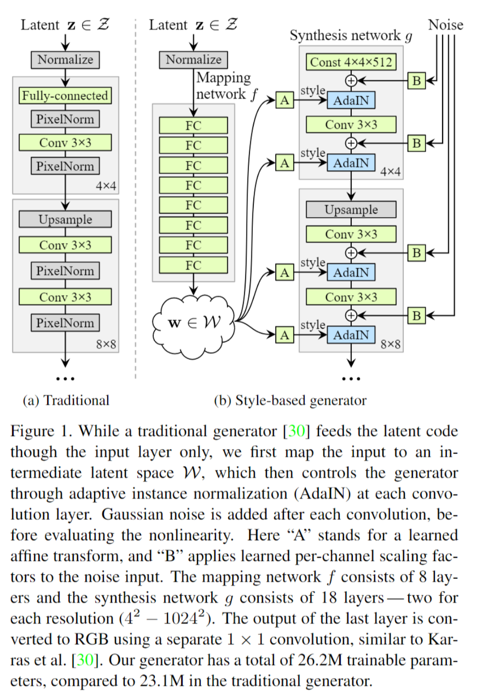
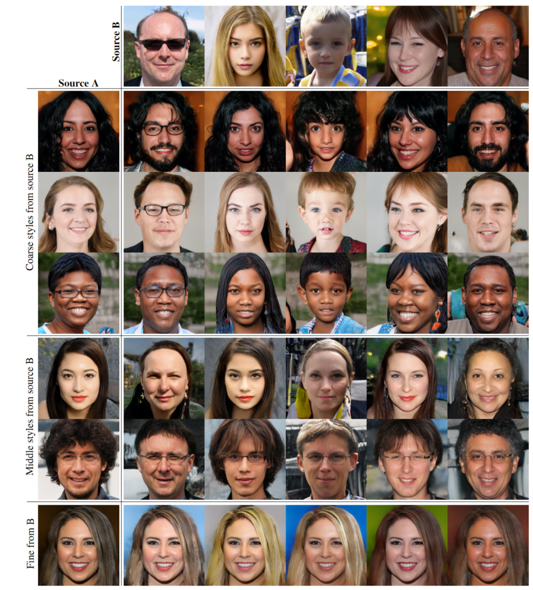
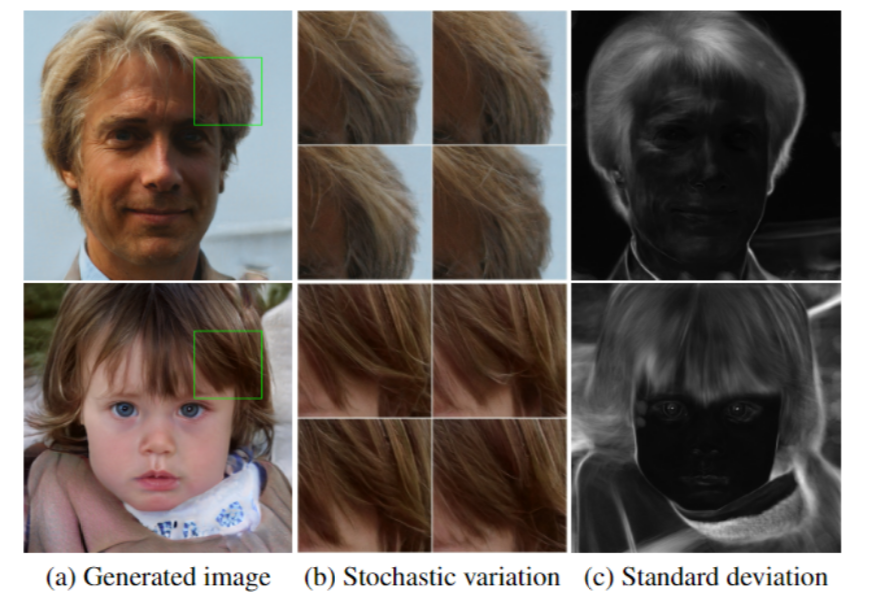

# A Style-Based Generator Architecture for Generative Adversarial Networks

## I. Abstract

Contribution:

- **A new architecture for Generative Network** in GAN
  - Automatically learned, unsupervised separation of high-level attributes (e.g., pose and identity when trained on humanfaces) 
  - Stochastic  variation  in  the  generated  images(e.g., freckles, hair)
  - Enables intuitive, scale-specific control of the synthesis. 
- A new, highly varied and high-quality **dataset of human faces** (Flickr-Faces-HQ,  FFHQ)

## II. Background

1. **AdaIN** ([Adaptive Instance Normalization](https://www.jianshu.com/p/7aeb1b41930b))
   - BN (Batch Normalization) -> mini-batch scale
   - IN (Instance Normalization) -> instance-scale, per channel
   - CIN (Conditional Instance Normalization) : 不同的style表示为对Normalization结果的平移$\beta_s$和缩放$\gamma_s$，每种style就学习这两个参数，其他出feature map的卷积参数是相同的
2. [Style Transfer](https://www.sohu.com/a/231582605_500659)

## III. Style-based generator

### (1) Architecture

#### 1. Non-linear mapping network $f$

- 8-layer MLP
- latent code $z \rightarrow$ intermediate latent code $w$

#### 2. Synthesis network $g$:

- 18-layer Conv (2 for each resolution, $4^2\sim 1024^2$ )
- Generate a novel image based on a collection of styles

#### 3. Learned affine transform $A$:

- intermediate latent code $w \rightarrow$ styles $y=(y_s, y_b)$ (s: scale, b: bias)

- $$
  AdaIN(x_i,y)=y_{s,i}\frac{x_i-\mu(x_i)}{\sigma(x_i)}+y_{b,i}
  $$

- feature map $x_i$ is  normalized  separately,  and then scaled and biased using the corresponding scalar components from style $y$.

- $f$ and $A$ draw samples for each style from a learned distribution

#### 4. Learned per-channel scaling factor $B$

- Noise: single-channel image of Gaussian noise
- Use $B$ to broadcast noise image to all feature maps

### (2) Property

#### 1. Style mixing

- Use 2 latent code during training.
- When generating new images, switch from one latent code to another at a randomly selected point in the synthesis network.
- Prevent the network from assuming that adjacent styles are correlated to further **encourage the styles to localize**

 2 latent code from Source A & B applied in style mixing

- In coarse resolution($4^2-8^2$): high-level aspects such as pose, general hair style, face shape, and eyeglasses
- In middle resolution($16^2-32^2$): smaller scale facial features, hair style, eyes open/closed
- In fine scale: mainly the color scheme and micro-structure

#### 2. Stochastic variation

- Add per-pixel noise after each convolution 
- The noise affects only the stochastic aspects, leaving the overall composition and high-level aspects such as identity intact

- The noise  appears **tightly localized** in the network. 

#### 3. Separation of global effects from stochasticity

- Spatially invariant statistics (Gram matrix, channel-wise mean, variance, etc.) reliably encode the style of an image, while spatially varying features encode a specific instance
- **Global - The style affects the entire image**
  - complete feature  maps are scaled and biased with the same values.  
  - global effects such as pose, lighting, or background style can be controlled coherently
- **Local - The noise is added independently to each pixel**
  - Suited for controlling stochastic variation

