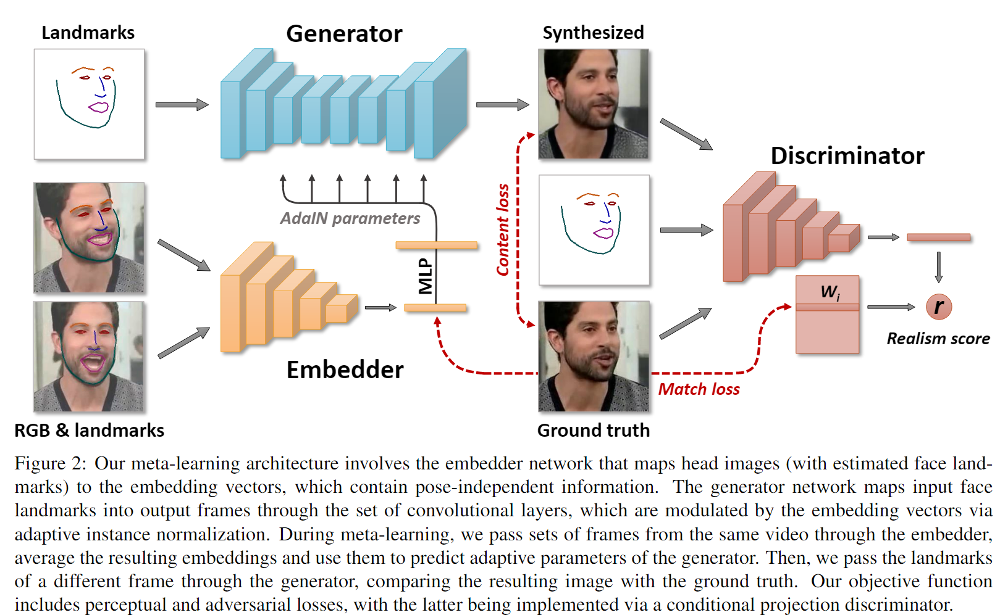
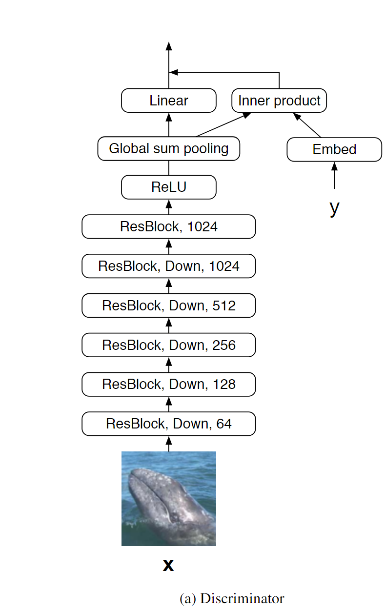

# Few-Shot Adversarial Learning of Realistic Neural Talking Head Models

## I. Introduction

Contribution:

- A system for creating talking head models **from a handful of photographs (few-shot learning)** 
  - Create by **deep ConvNets** that synthesize video frames in a direct manner rather than by warping
  - Handle a large variety of poses

Few-shot learning:

- Pre-training **(meta-learning**) on a large corpus of talking head videos, learning to transform landmark positions into realistically-looking personalized  photographs
- Photographs of a  new person sets up **a new adversarial learning**  problem with generator and discriminator pre-trained via meta-learning.

## II. Related Tech

1. Perceptual Similarity Measure([Perceptual Loss](https://arxiv.org/abs/1603.08155))
   - perceptual loss function depends on **high-level features from a pre-trained loss network**.
   - 
     - measure similarity by difference of features in some certain layers in Loss Network, rather than pixel differences of images
2. Projection Discriminator([cGANs with Projection Discriminator](https://openreview.net/forum?id=ByS1VpgRZ))
   - Use a **projection based way** to incorporate the conditional information into the discriminator of GANs,  instead of concatenating the (embedded) conditional vector to the feature vectors. 
   - 
     - $\phi$ is the ConvNet, which outputs an activated vector
     - $y$ serves as a one-hot id to extract corresponding embedded vector from a trainable embedding matrix
     - $\psi$ is a linear transform: $\omega x + b$

## III. Architecture

### (0).  Data

- $M$ video sequences
- $x_i$: $i$-th video sequence
- $x_i(t)$: $t$-th frame in $x_i$
- $y_i(t)$: *landmark* image for $x_i(t)$

### (1).  Embedder

$$
\hat e_i(s) = E(x_i(s),y_i(s);\phi)
$$

- $\phi$ : the network parameters
- Embedder $E$ maps a video frame and associated landmark image into an $N$-dimensional vector $\hat e_i(s)$
- Want $\hat e_i(s)$ to contain **video-specific information (such as identity)** that is invariant to the pose and mimics in a particular frame $s$

### (2). Generator

$$
\hat x_i(t) = G(y_i(t),\hat e_i;\psi, P)
$$

- All parameters of the generator are split into two sets: 
  - **Person-generic parameters $\psi$:** The ConvNet
  - **Person-specific parameters $\hat{\psi}_i$:** AdaIN(adaptive instance normalization) parameters
- Trainable projection $P$: the MLP which convert embedding $\hat e_i$ to AdaIN params
- Generator $G$ takes the landmark image(new pose) and predicted video embedding(identity), and outputs a synthesized video frame**(identity with new pose)**

### (3). Discriminator

$$
r = D(x_i(t),y_i(t),i;\theta,W,w_0,b)
$$

- $\theta$: params of ConvNet $V$
  -  $V(x_i(t),y_i(t);\theta)$ maps the input frame and the landmark image into an N-dimensional vector
- $W$: embedding matrix
  - Extracted embedding is  $i$-th column in $W$
- $w_0,b$: params of linear transform (see Projection Discriminator)

- The Discriminator $D$ predicts a single scalar (realism score) $r$, that indicates whether the input frame is a real frame of the $i$-th video sequence, and whether it matches the input pose

## IV. Learning

### (1). Meta-learning stage

#### 1. Embedding

$$
\hat e_i=\frac{1}{K}\sum_{k=1}^{K}E(x_i(s_k),y_i(s_k);\phi)
$$

- Randomly
  $$
  
  $$
   draw a training **video sequence $i$,** then draw a **single frame $t$** and **additional $K$ frames** $s_1,s_2,...,s_K$ from the sequence

- Embedding $\hat e_i$ for the sequence is the **average** of embeddings predicted for additional frames 

#### 2. Generating

$$
\hat x_i(t) = G(y_i(t),\hat e_i;\psi, P)
$$

#### 3. Discrimination

$$
\begin{equation}
\begin{split}
\hat r&=D(\hat x_i(t),y_i(t),i;\theta,W,w_0,b)\\
&=V(\hat x_i(t),y_i(t);\theta)^T(W_i+w_0)+b
\end{split}
\end{equation}
$$

- $W_i$: the $i$-th column of the embedding matrix $W$
- $w_0,b$: do not depend on the video index, just related with frame images and landmark images

#### 4. Loss

##### part 1

$$
\begin{equation}
\begin{split}
L(\phi,\psi,P,\theta,W,w_0,b)=&L_{CNT}(\phi,\psi,P)+\\
&L_{ADV}((\phi,\psi,P,\theta,W,w_0,b)+\\
&L_{MCH}(\phi,W)
\end{split}
\end{equation}
$$

- Content Loss $L_{CNT}$: 

  - measures the weighted $L_1$ loss between the ground truth image $x_i(t)$ and the reconstruction $\hat x_i(t)$ using the perceptual similarity measure in $VGG19$ and $VGGFace$

- Adversarial Loss $L_{ADV}$:

  - $$
    \begin{equation}
    \begin{split}
    L_{ADV}(\phi,\psi,P,\theta,W,w_0,b)&=-\hat r+L_{FM}
    \end{split}
    \end{equation}
    $$
    
- Maximize $\hat r$
    - Feature matching term $L_{FM}$: a perceptual similarity measure computed using activations after each residual block of the discriminator network
  
- Match Loss $L_{MCH}$:

  - Encourages the similarity of the two types of embeddings by penalizing the $L1$ difference between $\hat e_i$ and $W_i$.

##### part 2

$$
L_{DSC}((\phi,\psi,P,\theta,W,w_0,b)=\max(0,1+\hat r)+\max(0,1-r)
$$

- Discrimination Loss $L_{DSC}$:
  - Encourages the increase of the realism score on real images $x_i(t)$ and decrease on synthesized images $\hat x_i(t)$

### (2). Few-shot fine-tuning

#### 1. Embedding

$$
\hat e_{NEW}=\frac{1}{T}\sum_{t=1}^{T}E(x(t),y(t);\phi)
$$

- $T(T=K)$ training images $x(1),x(2),...,x(T)$ and corresponding landmarks

#### 2. Generating

$$
\hat x(t) = G(y(t);\psi, \psi^\prime)
$$

- Person-specific generator parameter $\psi^\prime$: initialized as $P\hat e_{NEW}$

#### 3. Discrimination

$$
\begin{equation}\begin{split}\hat r^\prime&=D(\hat x(t),y(t),i;\theta,w^\prime,b)\\&=V(\hat x(t),y(t);\theta)^Tw^\prime+b\end{split}\end{equation}
$$

- Role of $w^\prime$ is the same as $W_i+w_0$. Since $L_{MCH}$ ensures the similarity between  $\hat e_i$ and $W_i$, so $w^\prime$ is initialized as $\hat e_{NEW}+w_0$.

#### 4. Loss

##### part 1

$$
\begin{equation}
\begin{split}
L^\prime(\psi,\psi^\prime,\theta,w^\prime,b)=&L_{CNT}^\prime(\psi,\psi^\prime)+\\
&L_{ADV}^\prime(\psi,\psi^\prime,\theta,w^\prime,b)
\end{split}
\end{equation}
$$

##### part 2

$$
L_{DSC}^\prime((\psi,\psi^\prime,\theta,w^\prime,b)=\max(0,1+\hat r^\prime)+\max(0,1-r^\prime)
$$

