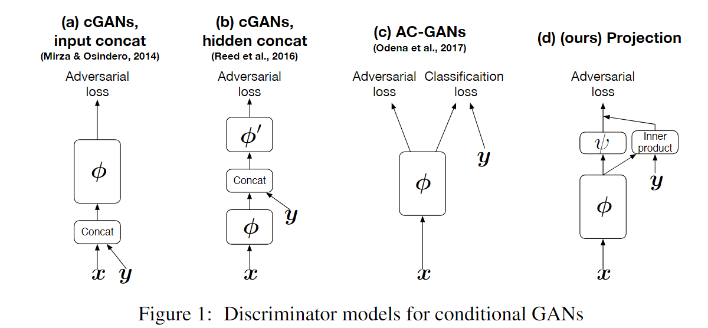

# Few-Shot Adversarial Learning of Realistic Neural Talking Head Models

## I. Introduction

Contribution:

- A system for creating talking head models **from a handful of photographs (few-shot learning)** 
  - Create by **deep ConvNets** that synthesize video frames in a direct manner rather than by warping
  - Handle a large variety of poses

Few-shot learning:

- Pre-training **(meta-learning**) on a large corpus of talking head videos, learning to transform landmark positions into realistically-looking personalized  photographs
- Photographs of a  new person sets up **a new adversarial learning**  problem with generator and discriminator pre-trained via meta-learning.

## II. Related Tech

1. Perceptual Similarity Measure([Perceptual Loss](https://arxiv.org/abs/1603.08155))
   - perceptual loss function depends on **high-level features from a pre-trained loss network**.
   - 
     - measure similarity by difference of features in some certain layers in Loss Network, rather than pixel differences of images
2. Projection Discriminator([cGANs with Projection Discriminator](https://openreview.net/forum?id=ByS1VpgRZ))
   - Use a **projection based way** to incorporate the conditional information into the discriminator of GANs,  instead of concatenating the (embedded) conditional vector to the feature vectors. 
   - 
     - $\phi$ is the ConvNet, which outputs an activated vector
     - $y$ serves as a one-hot id to extract corresponding embedding vector from a trainable embedding matrix
     - $\psi$ is a linear transform: $\omega x + b$

## III. Architecture

